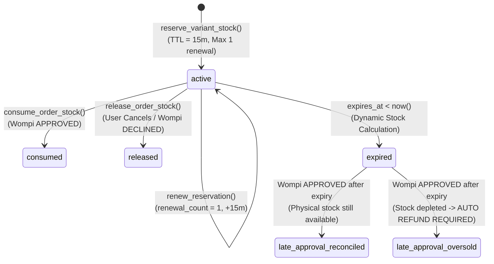

# Architecture & Technical Design Specification: Phase 1 (P1) - Revision 2
**PartyFlow: Commercial Catalog, Multi-Location Inventory, Transactional Checkout & Wompi Integration**

---

## 1. Remote Supabase Schema Audit vs. CI Baseline Fixture

### 1.1 Remote Connectivity & DNS Diagnostic
An automated network audit was performed against the Supabase instances in `.env`:
- Primary URL: `https://ewtohcmqzhqqtnvdujge.supabase.co`
- Secondary URL: `https://uvxywbziypgfbnatrwor.supabase.co`

**DNS Evidence & Cause Analysis:**
- Cloudflare authoritative nameservers for `supabase.co` (`neil.ns.cloudflare.com`, `christina.ns.cloudflare.com`) return:
  `RCODE 3: NXDOMAIN (DNS_ERROR_RCODE_NAME_ERROR)`.
- **Finding:** Neither local caching nor network firewalls are at fault. Cloudflare's authoritative DNS zone does not contain records for `ewtohcmqzhqqtnvdujge`. This indicates the remote project reference was deleted or de-allocated in Supabase Cloud.
- **Development Strategy:** All P1 engineering and validation will execute against the isolated local Docker Supabase environment and CI test harness.

### 1.2 Schema Delta Matrix: Confirmed vs. Proposed

| Entity / Domain | Baseline Fixture (`test_schema.sql` + P0) | P1 Target Architecture | Migration Strategy | Status |
| :--- | :--- | :--- | :--- | :--- |
| **`profiles`** | Confirmed: RLS, `is_admin()`, roles `client`, `driver`, `warehouse`, `admin` | Preserved as-is | No change | **Confirmed** |
| **`categories`** | Flat string `products.category` | Dedicated relational table with slug, parent hierarchy, display order | Additive table + backfill | **Proposed** |
| **`products`** | Flat entity with direct price, image, name | Parent catalog entity (metadata, brand, slug, age-restriction, gallery) | Non-destructive evolution | **Proposed** |
| **`product_variants`** | Non-existent | Sellable SKU entity (attributes, barcode, packaging, volume, price in cents) | Additive table + default variant backfill | **Proposed** |
| **`warehouses`** | Non-existent | Location entity (id, code, name, address, active status) | Additive table with default warehouse | **Proposed** |
| **`inventory`** | `(product_id, physical_quantity)` | `(variant_id, warehouse_id, physical_quantity, safety_stock)` | Transition to compound PK | **Proposed** |
| **`stock_reservations`** | Bound to `product_id`, basic TTL | Bound to `variant_id`, `warehouse_id`, `order_id`, with states: `active`, `consumed`, `released`, `expired` | Additive columns + status machine | **Proposed** |
| **`carts` & `cart_items`** | None (client `localStorage`) | Server-side persistent sessions with 7-day TTL | Additive tables | **Proposed** |
| **`orders`** | Minimal accounting baseline | Production orders: `order_number`, customer snapshot, geocoding, fee breakdown in cents, idempotency key | Additive columns & strict constraints | **Proposed** |
| **`order_items`** | `(product_id, quantity, unit_cost)` | Snapshot entity: `variant_id`, SKU, product name, presentation, unit price, unit cost in cents | Additive columns & frozen snapshots | **Proposed** |
| **`payments`** | Non-existent | Wompi payment entity: reference, transaction ID, state machine, checksum signature | Additive table | **Proposed** |
| **`wompi_events_log`** | Non-existent | Idempotent webhook audit log: retry counter, lock state, payload snapshot | Additive table | **Proposed** |

---

## 2. Incremental Schema Evolution (Zero Data-Loss & Rollback Plan)

### Stage 1: Categories & Product Variants (Non-Destructive Transition)
Existing `products` rows will retain their `price` column temporarily for backward compatibility while generating a 1:1 default variant in `product_variants`.

```sql
-- Step 1.1: Warehouses Table (Default single-warehouse support with multi-warehouse readiness)
CREATE TABLE public.warehouses (
  id UUID PRIMARY KEY DEFAULT gen_random_uuid(),
  code TEXT NOT NULL UNIQUE,
  name TEXT NOT NULL,
  address TEXT NOT NULL,
  is_active BOOLEAN NOT NULL DEFAULT true,
  created_at TIMESTAMPTZ NOT NULL DEFAULT now(),
  updated_at TIMESTAMPTZ NOT NULL DEFAULT now()
);

-- Seed default central warehouse
INSERT INTO public.warehouses (id, code, name, address)
VALUES ('00000000-0000-0000-0000-000000000001', 'BOD-CENTRAL', 'Bodega Principal', 'Bogotá D.C., Colombia')
ON CONFLICT (id) DO NOTHING;

-- Step 1.2: Categories Table
CREATE TABLE public.categories (
  id UUID PRIMARY KEY DEFAULT gen_random_uuid(),
  slug TEXT NOT NULL UNIQUE,
  name TEXT NOT NULL,
  description TEXT,
  parent_id UUID REFERENCES public.categories(id) ON DELETE SET NULL,
  display_order INTEGER NOT NULL DEFAULT 0,
  is_active BOOLEAN NOT NULL DEFAULT true,
  created_at TIMESTAMPTZ NOT NULL DEFAULT now(),
  updated_at TIMESTAMPTZ NOT NULL DEFAULT now()
);

-- Backfill categories from existing products table
INSERT INTO public.categories (slug, name)
SELECT DISTINCT 
  lower(regexp_replace(COALESCE(category, 'General'), '[^a-zA-Z0-9]+', '-', 'g')),
  COALESCE(category, 'General')
FROM public.products
ON CONFLICT (slug) DO NOTHING;

-- Step 1.3: Evolve Products
ALTER TABLE public.products 
  ADD COLUMN IF NOT EXISTS slug TEXT,
  ADD COLUMN IF NOT EXISTS category_id UUID REFERENCES public.categories(id) ON DELETE RESTRICT,
  ADD COLUMN IF NOT EXISTS brand TEXT,
  ADD COLUMN IF NOT EXISTS description TEXT,
  ADD COLUMN IF NOT EXISTS media_gallery JSONB NOT NULL DEFAULT '[]'::jsonb,
  ADD COLUMN IF NOT EXISTS is_age_restricted BOOLEAN NOT NULL DEFAULT true,
  ADD COLUMN IF NOT EXISTS is_active BOOLEAN NOT NULL DEFAULT true,
  ADD COLUMN IF NOT EXISTS tags TEXT[] DEFAULT '{}',
  ADD COLUMN IF NOT EXISTS display_order INTEGER NOT NULL DEFAULT 0,
  ADD COLUMN IF NOT EXISTS updated_at TIMESTAMPTZ NOT NULL DEFAULT now();

-- Backfill products.category_id & slug
UPDATE public.products p
SET 
  category_id = c.id,
  slug = lower(regexp_replace(p.name, '[^a-zA-Z0-9]+', '-', 'g')) || '-' || substr(p.id::text, 1, 6)
FROM public.categories c
WHERE lower(regexp_replace(COALESCE(p.category, 'General'), '[^a-zA-Z0-9]+', '-', 'g')) = c.slug
  AND p.category_id IS NULL;

ALTER TABLE public.products ALTER COLUMN slug SET NOT NULL;
CREATE UNIQUE INDEX IF NOT EXISTS idx_products_slug ON public.products(slug);

-- Step 1.4: Product Variants Table
CREATE TABLE public.product_variants (
  id UUID PRIMARY KEY DEFAULT gen_random_uuid(),
  product_id UUID NOT NULL REFERENCES public.products(id) ON DELETE CASCADE,
  sku TEXT NOT NULL UNIQUE,
  barcode TEXT,
  presentation_label TEXT NOT NULL DEFAULT 'Unidad Estándar',
  attributes JSONB NOT NULL DEFAULT '{}'::jsonb,
  price_in_cents BIGINT NOT NULL CHECK (price_in_cents >= 0),
  cost_in_cents BIGINT NOT NULL DEFAULT 0 CHECK (cost_in_cents >= 0),
  compare_at_price_in_cents BIGINT CHECK (compare_at_price_in_cents IS NULL OR compare_at_price_in_cents >= price_in_cents),
  is_active BOOLEAN NOT NULL DEFAULT true,
  created_at TIMESTAMPTZ NOT NULL DEFAULT now(),
  updated_at TIMESTAMPTZ NOT NULL DEFAULT now()
);

-- Backfill default variant for every existing product (converting numeric price to COP cents)
INSERT INTO public.product_variants (
  product_id, sku, presentation_label, price_in_cents, cost_in_cents, is_active
)
SELECT 
  id, 
  'SKU-' || upper(substr(id::text, 1, 8)), 
  'Presentación Estándar', 
  (COALESCE(price, 0) * 100)::bigint, 
  0, 
  true
FROM public.products
ON CONFLICT (sku) DO NOTHING;
```

### Stage 2: Inventory Migration (Compound Key: `variant_id` + `warehouse_id`)
```sql
-- Step 2.1: Add variant_id & warehouse_id to inventory
ALTER TABLE public.inventory 
  ADD COLUMN IF NOT EXISTS variant_id UUID REFERENCES public.product_variants(id) ON DELETE CASCADE,
  ADD COLUMN IF NOT EXISTS warehouse_id UUID NOT NULL DEFAULT '00000000-0000-0000-0000-000000000001' REFERENCES public.warehouses(id) ON DELETE RESTRICT,
  ADD COLUMN IF NOT EXISTS safety_stock INTEGER NOT NULL DEFAULT 0 CHECK (safety_stock >= 0);

-- Backfill inventory.variant_id from product_variants
UPDATE public.inventory i
SET variant_id = pv.id
FROM public.product_variants pv
WHERE pv.product_id = i.product_id
  AND i.variant_id IS NULL;

-- Step 2.2: Redefine Primary Key on inventory (variant_id, warehouse_id)
-- Note: product_id remains as an optional deprecated column during migration window
ALTER TABLE public.inventory DROP CONSTRAINT IF EXISTS inventory_pkey;
ALTER TABLE public.inventory ALTER COLUMN variant_id SET NOT NULL;
ALTER TABLE public.inventory ADD CONSTRAINT inventory_pkey PRIMARY KEY (variant_id, warehouse_id);
```

### Stage 3: Carts, Orders, and Stock Reservations Evolution
```sql
-- Step 3.1: Server-side Carts
CREATE TABLE public.carts (
  id UUID PRIMARY KEY DEFAULT gen_random_uuid(),
  user_id UUID REFERENCES public.profiles(id) ON DELETE SET NULL,
  session_token TEXT NOT NULL UNIQUE,
  status TEXT NOT NULL DEFAULT 'active' CHECK (status IN ('active', 'converted', 'abandoned')),
  expires_at TIMESTAMPTZ NOT NULL DEFAULT (now() + INTERVAL '7 days'),
  created_at TIMESTAMPTZ NOT NULL DEFAULT now(),
  updated_at TIMESTAMPTZ NOT NULL DEFAULT now()
);

CREATE TABLE public.cart_items (
  id UUID PRIMARY KEY DEFAULT gen_random_uuid(),
  cart_id UUID NOT NULL REFERENCES public.carts(id) ON DELETE CASCADE,
  variant_id UUID NOT NULL REFERENCES public.product_variants(id) ON DELETE CASCADE,
  quantity INTEGER NOT NULL CHECK (quantity > 0 AND quantity <= 99),
  created_at TIMESTAMPTZ NOT NULL DEFAULT now(),
  updated_at TIMESTAMPTZ NOT NULL DEFAULT now(),
  CONSTRAINT uq_cart_variant UNIQUE (cart_id, variant_id)
);

-- Step 3.2: Evolve Orders Table
ALTER TABLE public.orders
  ADD COLUMN IF NOT EXISTS order_number TEXT UNIQUE,
  ADD COLUMN IF NOT EXISTS user_id UUID REFERENCES public.profiles(id) ON DELETE SET NULL,
  ADD COLUMN IF NOT EXISTS cart_id UUID REFERENCES public.carts(id) ON DELETE SET NULL,
  ADD COLUMN IF NOT EXISTS warehouse_id UUID NOT NULL DEFAULT '00000000-0000-0000-0000-000000000001' REFERENCES public.warehouses(id),
  ADD COLUMN IF NOT EXISTS customer_name TEXT NOT NULL DEFAULT '',
  ADD COLUMN IF NOT EXISTS customer_phone TEXT NOT NULL DEFAULT '',
  ADD COLUMN IF NOT EXISTS customer_email TEXT,
  ADD COLUMN IF NOT EXISTS delivery_address TEXT NOT NULL DEFAULT '',
  ADD COLUMN IF NOT EXISTS delivery_city TEXT NOT NULL DEFAULT 'Bogotá D.C.',
  ADD COLUMN IF NOT EXISTS delivery_lat DOUBLE PRECISION,
  ADD COLUMN IF NOT EXISTS delivery_lng DOUBLE PRECISION,
  ADD COLUMN IF NOT EXISTS delivery_notes TEXT,
  ADD COLUMN IF NOT EXISTS subtotal_in_cents BIGINT NOT NULL DEFAULT 0,
  ADD COLUMN IF NOT EXISTS delivery_fee_in_cents BIGINT NOT NULL DEFAULT 0,
  ADD COLUMN IF NOT EXISTS discount_in_cents BIGINT NOT NULL DEFAULT 0,
  ADD COLUMN IF NOT EXISTS tip_in_cents BIGINT NOT NULL DEFAULT 0,
  ADD COLUMN IF NOT EXISTS total_in_cents BIGINT NOT NULL DEFAULT 0,
  ADD COLUMN IF NOT EXISTS payment_status TEXT NOT NULL DEFAULT 'unpaid' 
    CHECK (payment_status IN ('unpaid', 'authorized', 'captured', 'declined', 'voided', 'refunded')),
  ADD COLUMN IF NOT EXISTS idempotency_key TEXT UNIQUE,
  ADD COLUMN IF NOT EXISTS updated_at TIMESTAMPTZ NOT NULL DEFAULT now();

-- Step 3.3: Evolve Order Items
ALTER TABLE public.order_items
  ADD COLUMN IF NOT EXISTS variant_id UUID REFERENCES public.product_variants(id),
  ADD COLUMN IF NOT EXISTS product_name_snapshot TEXT NOT NULL DEFAULT '',
  ADD COLUMN IF NOT EXISTS presentation_snapshot TEXT NOT NULL DEFAULT '',
  ADD COLUMN IF NOT EXISTS sku_snapshot TEXT NOT NULL DEFAULT '',
  ADD COLUMN IF NOT EXISTS unit_price_in_cents BIGINT NOT NULL DEFAULT 0,
  ADD COLUMN IF NOT EXISTS unit_cost_in_cents BIGINT NOT NULL DEFAULT 0,
  ADD COLUMN IF NOT EXISTS total_in_cents BIGINT NOT NULL DEFAULT 0;

-- Step 3.4: Evolve Stock Reservations
ALTER TABLE public.stock_reservations
  ADD COLUMN IF NOT EXISTS variant_id UUID REFERENCES public.product_variants(id) ON DELETE CASCADE,
  ADD COLUMN IF NOT EXISTS warehouse_id UUID NOT NULL DEFAULT '00000000-0000-0000-0000-000000000001' REFERENCES public.warehouses(id),
  ADD COLUMN IF NOT EXISTS order_id UUID REFERENCES public.orders(id) ON DELETE SET NULL,
  ADD COLUMN IF NOT EXISTS status TEXT NOT NULL DEFAULT 'active' CHECK (status IN ('active', 'consumed', 'released', 'expired')),
  ADD COLUMN IF NOT EXISTS renewal_count INTEGER NOT NULL DEFAULT 0 CHECK (renewal_count >= 0 AND renewal_count <= 1);

-- Backfill reservations variant_id from product_id if applicable
UPDATE public.stock_reservations sr
SET variant_id = pv.id
FROM public.product_variants pv
WHERE pv.product_id = sr.product_id
  AND sr.variant_id IS NULL;
```

### Stage 4: Payments & Wompi Webhooks Log
```sql
CREATE TABLE public.payments (
  id UUID PRIMARY KEY DEFAULT gen_random_uuid(),
  order_id UUID NOT NULL REFERENCES public.orders(id) ON DELETE CASCADE,
  provider TEXT NOT NULL DEFAULT 'wompi',
  wompi_transaction_id TEXT UNIQUE,
  wompi_reference TEXT NOT NULL UNIQUE,
  idempotency_key TEXT NOT NULL UNIQUE,
  amount_in_cents BIGINT NOT NULL CHECK (amount_in_cents > 0),
  currency TEXT NOT NULL DEFAULT 'COP',
  payment_method_type TEXT,
  status TEXT NOT NULL DEFAULT 'PENDING' CHECK (status IN ('PENDING', 'APPROVED', 'DECLINED', 'VOIDED', 'ERROR')),
  status_detail TEXT,
  integrity_signature TEXT NOT NULL,
  gateway_response JSONB DEFAULT '{}'::jsonb,
  created_at TIMESTAMPTZ NOT NULL DEFAULT now(),
  updated_at TIMESTAMPTZ NOT NULL DEFAULT now()
);

CREATE TABLE public.wompi_events_log (
  id UUID PRIMARY KEY DEFAULT gen_random_uuid(),
  event_id TEXT NOT NULL UNIQUE,
  event_type TEXT NOT NULL,
  transaction_id TEXT,
  reference TEXT,
  signature_checksum TEXT NOT NULL,
  payload JSONB NOT NULL,
  status TEXT NOT NULL DEFAULT 'received' CHECK (status IN ('received', 'processing', 'processed', 'failed', 'ignored')),
  retry_count INTEGER NOT NULL DEFAULT 0,
  max_retries INTEGER NOT NULL DEFAULT 5,
  last_error TEXT,
  locked_at TIMESTAMPTZ,
  locked_by TEXT,
  processed_at TIMESTAMPTZ,
  created_at TIMESTAMPTZ NOT NULL DEFAULT now()
);

CREATE INDEX idx_wompi_events_pending ON public.wompi_events_log(status, retry_count) 
  WHERE status IN ('received', 'failed');
```

---

## 3. Stock Reservations Lifecycle & Edge Case Handling



### 3.1 Edge Case: Late Payment Approval After Reservation Expiration
When a user initiates checkout, takes 16 minutes to complete 3D Secure / OTP, and Wompi sends `APPROVED` at minute 16:
1. `consume_order_stock` is executed within an ACID transaction:
   - Query current available inventory: `physical_quantity - safety_stock - active_reservations`.
   - **Path A (Stock available):** Immediately deduct `physical_quantity = physical_quantity - order_qty`, update reservation to `consumed`, and finalize order as `paid`. Log audit event: `late_approval_fulfilled`.
   - **Path B (Stock exhausted/taken by another customer):** System CANNOT fulfill order. The transaction sets `orders.status = 'cancelled'`, `orders.payment_status = 'refunded_pending'`, sets `payments.status = 'ERROR'`, and logs critical alert `OVERSOLD_AFTER_EXPIRATION_REFUND_QUEUED`. This triggers an automated call to Wompi's Void/Refund API or notifies staff immediately.

---

## 4. Atomic PostgreSQL Checkout Transaction

To avoid partial failure between client and server, checkout initiation is executed via an atomic database function:

```sql
CREATE OR REPLACE FUNCTION public.process_checkout_atomic(
  p_cart_id UUID,
  p_warehouse_id UUID,
  p_idempotency_key TEXT,
  p_customer_name TEXT,
  p_customer_phone TEXT,
  p_customer_email TEXT,
  p_delivery_address TEXT,
  p_delivery_city TEXT,
  p_delivery_lat DOUBLE PRECISION,
  p_delivery_lng DOUBLE PRECISION,
  p_delivery_notes TEXT,
  p_delivery_fee_in_cents BIGINT,
  p_tip_in_cents BIGINT
) RETURNS JSONB AS $$
DECLARE
  v_existing_order RECORD;
  v_order_id UUID;
  v_order_number TEXT;
  v_item RECORD;
  v_subtotal BIGINT := 0;
  v_total BIGINT := 0;
  v_wompi_ref TEXT;
  v_physical_stock INTEGER;
  v_safety_stock INTEGER;
  v_reserved_stock INTEGER;
BEGIN
  -- 1. Idempotency Check: return existing order if key was already submitted
  SELECT id, order_number, total_in_cents, status, payment_status
  INTO v_existing_order
  FROM public.orders
  WHERE idempotency_key = p_idempotency_key;

  IF FOUND THEN
    SELECT wompi_reference INTO v_wompi_ref FROM public.payments WHERE order_id = v_existing_order.id;
    RETURN jsonb_build_object(
      'status', 'idempotent_hit',
      'order_id', v_existing_order.id,
      'order_number', v_existing_order.order_number,
      'total_in_cents', v_existing_order.total_in_cents,
      'wompi_reference', v_wompi_ref
    );
  END IF;

  -- 2. Verify Cart has items
  IF NOT EXISTS (SELECT 1 FROM public.cart_items WHERE cart_id = p_cart_id) THEN
    RAISE EXCEPTION 'CART_EMPTY: Cart % has no items', p_cart_id;
  END IF;

  -- 3. Lock & Validate Inventory for every item in cart
  FOR v_item IN (
    SELECT 
      ci.variant_id, ci.quantity, pv.sku, pv.presentation_label,
      pv.price_in_cents, pv.cost_in_cents, p.name AS product_name
    FROM public.cart_items ci
    JOIN public.product_variants pv ON pv.id = ci.variant_id
    JOIN public.products p ON p.id = pv.product_id
    WHERE ci.cart_id = p_cart_id
  ) LOOP
    -- Row-level lock on inventory
    SELECT physical_quantity, safety_stock 
    INTO v_physical_stock, v_safety_stock
    FROM public.inventory
    WHERE variant_id = v_item.variant_id AND warehouse_id = p_warehouse_id
    FOR UPDATE;

    IF v_physical_stock IS NULL THEN
      RAISE EXCEPTION 'STOCK_UNAVAILABLE: SKU % not stocked at location', v_item.sku;
    END IF;

    -- Calculate active reservations
    SELECT COALESCE(SUM(quantity), 0) INTO v_reserved_stock
    FROM public.stock_reservations
    WHERE variant_id = v_item.variant_id 
      AND warehouse_id = p_warehouse_id
      AND status = 'active'
      AND expires_at > now();

    IF (v_physical_stock - v_safety_stock - v_reserved_stock) < v_item.quantity THEN
      RAISE EXCEPTION 'INSUFFICIENT_STOCK: Item % only has % available', 
        v_item.product_name, (v_physical_stock - v_safety_stock - v_reserved_stock);
    END IF;

    v_subtotal := v_subtotal + (v_item.price_in_cents * v_item.quantity);
  END LOOP;

  v_total := v_subtotal + p_delivery_fee_in_cents + p_tip_in_cents;
  v_order_number := 'PF-' || to_char(now(), 'YYYYMMDD') || '-' || upper(substr(gen_random_uuid()::text, 1, 6));

  -- 4. Create Order
  INSERT INTO public.orders (
    order_number, cart_id, warehouse_id, customer_name, customer_phone, customer_email,
    delivery_address, delivery_city, delivery_lat, delivery_lng, delivery_notes,
    subtotal_in_cents, delivery_fee_in_cents, tip_in_cents, total_in_cents,
    status, payment_status, idempotency_key
  ) VALUES (
    v_order_number, p_cart_id, p_warehouse_id, p_customer_name, p_customer_phone, p_customer_email,
    p_delivery_address, p_delivery_city, p_delivery_lat, p_delivery_lng, p_delivery_notes,
    v_subtotal, p_delivery_fee_in_cents, p_tip_in_cents, v_total,
    'pending_payment', 'unpaid', p_idempotency_key
  ) RETURNING id INTO v_order_id;

  -- 5. Snapshot Order Items & Create Reservations bound to order
  FOR v_item IN (
    SELECT 
      ci.variant_id, ci.quantity, pv.sku, pv.presentation_label,
      pv.price_in_cents, pv.cost_in_cents, p.name AS product_name
    FROM public.cart_items ci
    JOIN public.product_variants pv ON pv.id = ci.variant_id
    JOIN public.products p ON p.id = pv.product_id
    WHERE ci.cart_id = p_cart_id
  ) LOOP
    INSERT INTO public.order_items (
      order_id, variant_id, product_name_snapshot, presentation_snapshot,
      sku_snapshot, quantity, unit_price_in_cents, unit_cost_in_cents, total_in_cents
    ) VALUES (
      v_order_id, v_item.variant_id, v_item.product_name, v_item.presentation_label,
      v_item.sku, v_item.quantity, v_item.price_in_cents, v_item.cost_in_cents,
      v_item.price_in_cents * v_item.quantity
    );

    INSERT INTO public.stock_reservations (
      variant_id, warehouse_id, cart_id, order_id, quantity, status, expires_at
    ) VALUES (
      v_item.variant_id, p_warehouse_id, p_cart_id, v_order_id, v_item.quantity,
      'active', now() + INTERVAL '15 minutes'
    );
  END LOOP;

  -- 6. Generate Wompi Reference and Payment Record
  v_wompi_ref := v_order_number || '-' || floor(extract(epoch from now()))::text;

  INSERT INTO public.payments (
    order_id, provider, wompi_reference, idempotency_key, amount_in_cents,
    currency, status, integrity_signature
  ) VALUES (
    v_order_id, 'wompi', v_wompi_ref, p_idempotency_key, v_total,
    'COP', 'PENDING', 'pending_hash'
  );

  RETURN jsonb_build_object(
    'status', 'created',
    'order_id', v_order_id,
    'order_number', v_order_number,
    'total_in_cents', v_total,
    'wompi_reference', v_wompi_ref
  );
END;
$$ LANGUAGE plpgsql SECURITY DEFINER SET search_path = public;

REVOKE ALL ON FUNCTION public.process_checkout_atomic FROM public, anon, authenticated;
GRANT EXECUTE ON FUNCTION public.process_checkout_atomic TO service_role;
```

---

## 5. Official Wompi Integration: Security & Webhook Validation

### 5.1 Distinct Secrets Separation
- **`WOMPI_INTEGRITY_SECRET`**: Used **only** at checkout session creation to compute the client widget checksum:
  $$\text{Integrity Checksum} = \text{SHA-256}(\text{reference} + \text{amount\_in\_cents} + \text{"COP"} + \text{WOMPI\_INTEGRITY\_SECRET})$$
- **`WOMPI_EVENTS_SECRET`**: Used **only** on the backend to validate incoming HTTP webhooks from Wompi.

### 5.2 Official Webhook Signature Checksum Calculation
Wompi webhooks transmit payload structure:
```json
{
  "event": "transaction.updated",
  "data": {
    "transaction": {
      "id": "100-1728000-12345",
      "amount_in_cents": 18500000,
      "reference": "PF-20261008-ABC123-1728000",
      "status": "APPROVED",
      "currency": "COP"
    }
  },
  "signature": {
    "properties": [
      "transaction.id",
      "transaction.status",
      "transaction.amount_in_cents"
    ],
    "checksum": "d5a8...42f0"
  },
  "timestamp": 1728400000,
  "environment": "test"
}
```

**Backend Signature Validation Algorithm:**
```typescript
import crypto from 'crypto';

export function verifyWompiWebhookSignature(
  payload: any,
  eventsSecret: string
): boolean {
  const { data, signature, timestamp } = payload;
  if (!signature?.properties || !signature?.checksum || !timestamp) {
    return false;
  }

  // 1. Resolve dotted paths in exact order of signature.properties
  let concatenatedValues = '';
  for (const propPath of signature.properties) {
    const keys = propPath.split('.');
    let current: any = data;
    for (const key of keys) {
      if (current === undefined || current === null) break;
      current = current[key];
    }
    concatenatedValues += current !== undefined ? String(current) : '';
  }

  // 2. Append timestamp and events secret
  const rawString = `${concatenatedValues}${timestamp}${eventsSecret}`;

  // 3. Compute SHA-256 hash
  const computedHash = crypto.createHash('sha256').update(rawString, 'utf8').digest('hex');

  // 4. Timing-safe comparison to prevent side-channel timing attacks
  const computedBuffer = Buffer.from(computedHash, 'utf8');
  const receivedBuffer = Buffer.from(signature.checksum, 'utf8');

  if (computedBuffer.length !== receivedBuffer.length) {
    return false;
  }

  return crypto.timingSafeEqual(computedBuffer, receivedBuffer);
}
```

---

## 6. Monotonic State Machine & Recoverable Webhook Pipeline

### 6.1 Payment Transition Matrix (Forward-Only)

```
[unpaid] ---> [authorized] ---> [captured] ---> [refunded]
   |                |
   |---> [declined] |---> [voided]
   |
   |---> [voided]
```

**Guard Condition:**
Once `payment_status` is `captured` (or order status is `paid`):
- Any subsequent late or out-of-order event arriving with status `PENDING`, `DECLINED`, or `ERROR` is marked `ignored_stale_event` in `wompi_events_log`.
- Under no circumstances will a paid order be demoted back to unpaid or cancelled.

### 6.2 Recoverable Webhook Worker (At-Least-Once Delivery)
1. **Ingest Phase:** Insert raw body into `wompi_events_log` with status `received`. If `event_id` violates unique constraint, respond `200 OK` (idempotent duplicate).
2. **Locking Phase:** Worker selects pending events using:
   `SELECT * FROM wompi_events_log WHERE status IN ('received', 'failed') AND retry_count < max_retries FOR UPDATE SKIP LOCKED LIMIT 10;`
3. **Execution Phase:**
   - Transition status to `processing`, set `locked_at = now()`.
   - Execute stock settlement (`consume_order_stock` on APPROVED; `release_order_stock` on DECLINED).
   - Update status to `processed`, `processed_at = now()`.
4. **Failure Recovery:**
   - If an error occurs, increment `retry_count`, record `last_error`, set status to `failed`, and schedule retry with exponential backoff ($2^{\text{retry\_count}} \times 10\text{ seconds}$).

---

## 7. Row Level Security (RLS) & SQL Privileges

Every table is protected with least-privilege policies:

```sql
-- Enable RLS on all P1 tables
ALTER TABLE public.warehouses ENABLE ROW LEVEL SECURITY;
ALTER TABLE public.categories ENABLE ROW LEVEL SECURITY;
ALTER TABLE public.products ENABLE ROW LEVEL SECURITY;
ALTER TABLE public.product_variants ENABLE ROW LEVEL SECURITY;
ALTER TABLE public.inventory ENABLE ROW LEVEL SECURITY;
ALTER TABLE public.carts ENABLE ROW LEVEL SECURITY;
ALTER TABLE public.cart_items ENABLE ROW LEVEL SECURITY;
ALTER TABLE public.orders ENABLE ROW LEVEL SECURITY;
ALTER TABLE public.order_items ENABLE ROW LEVEL SECURITY;
ALTER TABLE public.stock_reservations ENABLE ROW LEVEL SECURITY;
ALTER TABLE public.payments ENABLE ROW LEVEL SECURITY;
ALTER TABLE public.wompi_events_log ENABLE ROW LEVEL SECURITY;

-- Revoke all default public permissions
REVOKE ALL ON ALL TABLES IN SCHEMA public FROM public, anon, authenticated;

-- Public Read Policies (Commercial Catalog)
GRANT SELECT ON public.categories TO anon, authenticated;
CREATE POLICY "Active categories are publicly readable" 
  ON public.categories FOR SELECT USING (is_active = true);

GRANT SELECT ON public.products TO anon, authenticated;
CREATE POLICY "Active products are publicly readable" 
  ON public.products FOR SELECT USING (is_active = true);

GRANT SELECT ON public.product_variants TO anon, authenticated;
CREATE POLICY "Active variants are publicly readable" 
  ON public.product_variants FOR SELECT USING (is_active = true);

-- Orders: Customer can read only their own orders
GRANT SELECT ON public.orders TO authenticated;
CREATE POLICY "Users can view own orders" 
  ON public.orders FOR SELECT 
  USING (auth.uid() = user_id OR public.is_admin());

GRANT SELECT ON public.order_items TO authenticated;
CREATE POLICY "Users can view own order items" 
  ON public.order_items FOR SELECT 
  USING (EXISTS (SELECT 1 FROM public.orders o WHERE o.id = order_id AND (o.user_id = auth.uid() OR public.is_admin())));

-- Administrative & Backend Access
GRANT ALL ON ALL TABLES IN SCHEMA public TO service_role;
```

---

## 8. Staged Migration Roadmap & Remote Schema Dependencies

| Stage | Focus & Scope | Migration Script Name | Remote Schema Preconditions / Risks |
| :--- | :--- | :--- | :--- |
| **Stage 1** | Warehouses, Categories, Products & Product Variants | `20261008000001_p1_catalog.sql` | **Low Risk:** Additive. Backfills default category & variants from existing products table. If remote has differing product columns, script validates column existence with `IF NOT EXISTS`. |
| **Stage 2** | Multi-Location Inventory & Safety Stock | `20261008000002_p1_inventory.sql` | **Medium Risk:** Migrates `inventory` PK to `(variant_id, warehouse_id)`. Requires Stage 1 default variants to be backfilled first. |
| **Stage 3** | Carts, Orders, and Enhanced Stock Reservations | `20261008000003_p1_checkout.sql` | **Medium Risk:** Introduces `process_checkout_atomic` RPC, links reservations to orders. Fully testable in isolated CI without external dependencies. |
| **Stage 4** | Wompi Payments & Webhook Event Audit Pipeline | `20261008000004_p1_wompi.sql` | **Zero Remote Risk:** Completely additive tables (`payments`, `wompi_events_log`). Validated with Wompi Sandbox credentials. |
