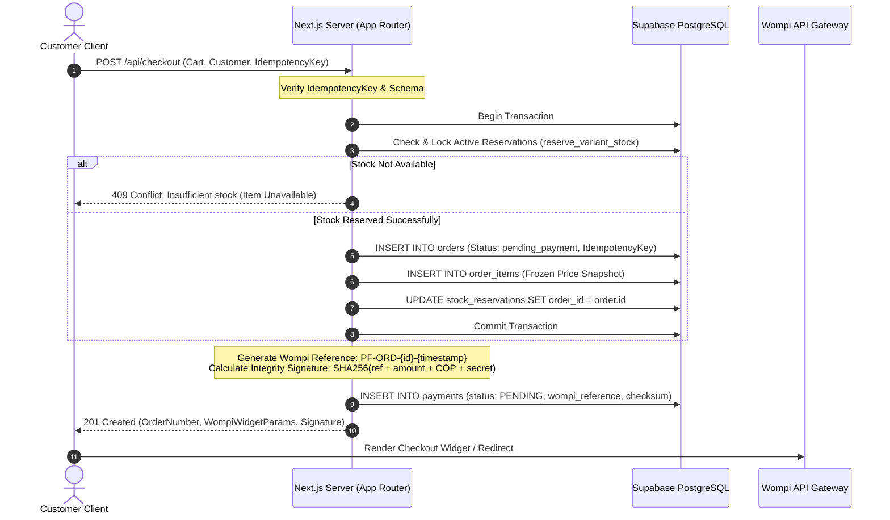
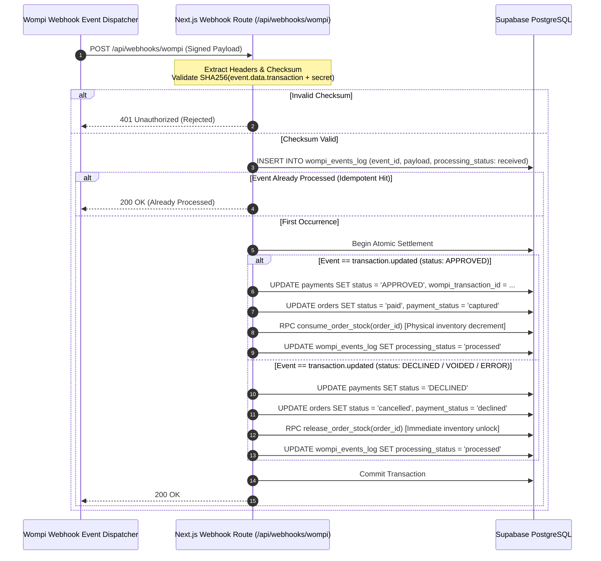

# Architecture & Technical Design Specification: Phase 1 (P1)
**PartyFlow: Commercial Catalog, Transactional Checkout & Wompi Payment Integration**

---

## 1. Remote Supabase Schema Audit vs. CI Baseline Fixture

### 1.1 Remote Connectivity & Infrastructure Audit Findings
An automated network audit was performed against the Supabase instances declared in the environment configuration (`.env`):
- Primary Remote URL: `https://ewtohcmqzhqqtnvdujge.supabase.co`
- Secondary/Commented URL: `https://uvxywbziypgfbnatrwor.supabase.co`

**Audit Diagnostic Result:**
- System DNS resolution for `supabase.co` and `google.com` is 100% operational (`76.76.21.21` and `172.217.29.14`).
- Host lookups for both remote subdomains failed with `getaddrinfo ENOTFOUND`.
- **Root Cause Analysis:** In the Supabase Cloud free tier, projects enter a paused state after 7 days of inactivity, or subdomains are de-allocated upon deletion.
- **CI Test Harness:** In CI (`.github/workflows/ci.yml`), Supabase is provisioned locally via Docker (`supabase/setup-cli@v1` on port 54321) using `supabase/tests/fixtures/test_schema.sql` and `supabase/migrations/20261007000000_p0_security.sql`.

### 1.2 Schema Gap Analysis (CI Fixture vs. Production P1 Architecture)

| Domain | CI Baseline Fixture (`test_schema.sql` + P0) | P1 Production Architecture Requirement | Gap Classification |
| :--- | :--- | :--- | :--- |
| **Catalog Hierarchy** | None (flat `products.category` string) | Dedicated `categories` table with slug, hierarchy, order | **Major Gap** |
| **Products & Presentations** | Single flat table (`products` with fixed price) | Normalized `products` (metadata) + `product_variants` (SKU, barcode, size, volume, price) | **Critical Gap** |
| **Inventory Tracking** | `inventory(product_id, physical_quantity)` | `inventory(variant_id, warehouse_id, physical_quantity, safety_stock)` | **Critical Gap** |
| **Stock Reservations** | Basic table (`product_id`, `cart_id`, `quantity`, `expires_at`) | Enhanced `stock_reservations` bound to `variant_id`, `cart_id`, `order_id`, and explicit lifecycle state | **Architecture Upgrade** |
| **Cart & Persistence** | None (client-side `localStorage` only) | Server-managed `carts` & `cart_items` with expiration and guest session linkage | **Critical Gap** |
| **Order Management** | Minimal `orders` (`total_amount`, `status`, `payment_method`) | Production `orders` with `order_number`, customer snapshot, geocoded coordinates, delivery breakdown, and idempotency key | **Critical Gap** |
| **Order Line Items** | Basic `order_items` (`product_id`, `quantity`, `unit_cost`) | Complete snapshot `order_items` (`variant_id`, SKU, product name, presentation name, unit price, unit cost, line total) | **Major Gap** |
| **Payment Gateway** | None | Dedicated `payments` table (Wompi transaction ID, reference, signature, state machine) + `wompi_events_log` | **Critical Gap** |

---

## 2. Definitive Relational Data Model (PostgreSQL / Supabase DDL)

```sql
-- ============================================================================
-- P1 COMMERCIAL CATALOG, CHECKOUT & PAYMENTS DDL
-- ============================================================================

-- 1. CATEGORIES TABLE
CREATE TABLE IF NOT EXISTS public.categories (
  id UUID PRIMARY KEY DEFAULT gen_random_uuid(),
  slug TEXT NOT NULL UNIQUE,
  name TEXT NOT NULL,
  description TEXT,
  parent_id UUID REFERENCES public.categories(id) ON DELETE SET NULL,
  display_order INTEGER NOT NULL DEFAULT 0,
  is_active BOOLEAN NOT NULL DEFAULT true,
  created_at TIMESTAMPTZ NOT NULL DEFAULT now(),
  updated_at TIMESTAMPTZ NOT NULL DEFAULT now()
);

CREATE INDEX IF NOT EXISTS idx_categories_slug ON public.categories(slug);
CREATE INDEX IF NOT EXISTS idx_categories_parent ON public.categories(parent_id);

-- 2. PRODUCTS TABLE (Parent Catalog Entity)
CREATE TABLE IF NOT EXISTS public.products (
  id UUID PRIMARY KEY DEFAULT gen_random_uuid(),
  category_id UUID NOT NULL REFERENCES public.categories(id) ON DELETE RESTRICT,
  name TEXT NOT NULL,
  slug TEXT NOT NULL UNIQUE,
  brand TEXT,
  description TEXT,
  image_url TEXT,
  media_gallery JSONB NOT NULL DEFAULT '[]'::jsonb,
  is_age_restricted BOOLEAN NOT NULL DEFAULT true,
  is_active BOOLEAN NOT NULL DEFAULT true,
  tags TEXT[] DEFAULT '{}',
  display_order INTEGER NOT NULL DEFAULT 0,
  created_at TIMESTAMPTZ NOT NULL DEFAULT now(),
  updated_at TIMESTAMPTZ NOT NULL DEFAULT now()
);

CREATE INDEX IF NOT EXISTS idx_products_category ON public.products(category_id);
CREATE INDEX IF NOT EXISTS idx_products_slug ON public.products(slug);
CREATE INDEX IF NOT EXISTS idx_products_active ON public.products(is_active);

-- 3. PRODUCT VARIANTS (Sellable SKUs)
CREATE TABLE IF NOT EXISTS public.product_variants (
  id UUID PRIMARY KEY DEFAULT gen_random_uuid(),
  product_id UUID NOT NULL REFERENCES public.products(id) ON DELETE CASCADE,
  sku TEXT NOT NULL UNIQUE,
  barcode TEXT,
  presentation_label TEXT NOT NULL, -- e.g., '750ml', 'Lata 330ml', 'Pack x 6'
  attributes JSONB NOT NULL DEFAULT '{}'::jsonb, -- e.g., {"volume_ml": 750, "pack_size": 1}
  price_in_cents BIGINT NOT NULL CHECK (price_in_cents >= 0),
  cost_in_cents BIGINT NOT NULL DEFAULT 0 CHECK (cost_in_cents >= 0),
  compare_at_price_in_cents BIGINT CHECK (compare_at_price_in_cents >= price_in_cents),
  is_active BOOLEAN NOT NULL DEFAULT true,
  created_at TIMESTAMPTZ NOT NULL DEFAULT now(),
  updated_at TIMESTAMPTZ NOT NULL DEFAULT now()
);

CREATE INDEX IF NOT EXISTS idx_variants_product ON public.product_variants(product_id);
CREATE INDEX IF NOT EXISTS idx_variants_sku ON public.product_variants(sku);

-- 4. INVENTORY TABLE
CREATE TABLE IF NOT EXISTS public.inventory (
  variant_id UUID PRIMARY KEY REFERENCES public.product_variants(id) ON DELETE CASCADE,
  physical_quantity INTEGER NOT NULL DEFAULT 0 CHECK (physical_quantity >= 0),
  safety_stock INTEGER NOT NULL DEFAULT 0 CHECK (safety_stock >= 0),
  updated_at TIMESTAMPTZ NOT NULL DEFAULT now()
);

-- 5. CARTS & CART ITEMS (Server-side Session & Cart State)
CREATE TABLE IF NOT EXISTS public.carts (
  id UUID PRIMARY KEY DEFAULT gen_random_uuid(),
  user_id UUID REFERENCES public.profiles(id) ON DELETE SET NULL,
  session_token TEXT NOT NULL UNIQUE,
  status TEXT NOT NULL DEFAULT 'active' CHECK (status IN ('active', 'converted', 'abandoned')),
  expires_at TIMESTAMPTZ NOT NULL DEFAULT (now() + INTERVAL '7 days'),
  created_at TIMESTAMPTZ NOT NULL DEFAULT now(),
  updated_at TIMESTAMPTZ NOT NULL DEFAULT now()
);

CREATE INDEX IF NOT EXISTS idx_carts_session ON public.carts(session_token);
CREATE INDEX IF NOT EXISTS idx_carts_user ON public.carts(user_id);

CREATE TABLE IF NOT EXISTS public.cart_items (
  id UUID PRIMARY KEY DEFAULT gen_random_uuid(),
  cart_id UUID NOT NULL REFERENCES public.carts(id) ON DELETE CASCADE,
  variant_id UUID NOT NULL REFERENCES public.product_variants(id) ON DELETE CASCADE,
  quantity INTEGER NOT NULL CHECK (quantity > 0),
  created_at TIMESTAMPTZ NOT NULL DEFAULT now(),
  updated_at TIMESTAMPTZ NOT NULL DEFAULT now(),
  CONSTRAINT uq_cart_variant UNIQUE (cart_id, variant_id)
);

-- 6. STOCK RESERVATIONS (Concurrency & Atomicity)
CREATE TABLE IF NOT EXISTS public.stock_reservations (
  id UUID PRIMARY KEY DEFAULT gen_random_uuid(),
  variant_id UUID NOT NULL REFERENCES public.product_variants(id) ON DELETE CASCADE,
  cart_id UUID NOT NULL REFERENCES public.carts(id) ON DELETE CASCADE,
  order_id UUID, -- Back-reference added upon checkout initiation
  quantity INTEGER NOT NULL CHECK (quantity > 0),
  status TEXT NOT NULL DEFAULT 'active' CHECK (status IN ('active', 'consumed', 'released', 'expired')),
  expires_at TIMESTAMPTZ NOT NULL,
  created_at TIMESTAMPTZ NOT NULL DEFAULT now()
);

CREATE INDEX IF NOT EXISTS idx_stock_res_variant_status ON public.stock_reservations(variant_id, status);
CREATE INDEX IF NOT EXISTS idx_stock_res_cart ON public.stock_reservations(cart_id);
CREATE INDEX IF NOT EXISTS idx_stock_res_expires ON public.stock_reservations(expires_at) WHERE status = 'active';

-- 7. ORDERS TABLE
CREATE TABLE IF NOT EXISTS public.orders (
  id UUID PRIMARY KEY DEFAULT gen_random_uuid(),
  order_number TEXT NOT NULL UNIQUE,
  user_id UUID REFERENCES public.profiles(id) ON DELETE SET NULL,
  cart_id UUID REFERENCES public.carts(id) ON DELETE SET NULL,
  
  -- Customer & Delivery Details Snapshot
  customer_name TEXT NOT NULL,
  customer_phone TEXT NOT NULL,
  customer_email TEXT,
  delivery_address TEXT NOT NULL,
  delivery_city TEXT NOT NULL,
  delivery_lat DOUBLE PRECISION NOT NULL,
  delivery_lng DOUBLE PRECISION NOT NULL,
  delivery_notes TEXT,
  
  -- Financial Breakdown (in COP Cents)
  subtotal_in_cents BIGINT NOT NULL CHECK (subtotal_in_cents >= 0),
  delivery_fee_in_cents BIGINT NOT NULL DEFAULT 0 CHECK (delivery_fee_in_cents >= 0),
  discount_in_cents BIGINT NOT NULL DEFAULT 0 CHECK (discount_in_cents >= 0),
  tip_in_cents BIGINT NOT NULL DEFAULT 0 CHECK (tip_in_cents >= 0),
  total_in_cents BIGINT NOT NULL CHECK (total_in_cents >= 0),
  
  -- Lifecycle States
  status TEXT NOT NULL DEFAULT 'pending_payment' CHECK (
    status IN ('pending_payment', 'paid', 'preparing', 'in_transit', 'delivered', 'cancelled')
  ),
  payment_status TEXT NOT NULL DEFAULT 'unpaid' CHECK (
    payment_status IN ('unpaid', 'authorized', 'captured', 'declined', 'voided', 'refunded')
  ),
  
  idempotency_key TEXT NOT NULL UNIQUE,
  created_at TIMESTAMPTZ NOT NULL DEFAULT now(),
  updated_at TIMESTAMPTZ NOT NULL DEFAULT now()
);

CREATE INDEX IF NOT EXISTS idx_orders_number ON public.orders(order_number);
CREATE INDEX IF NOT EXISTS idx_orders_user ON public.orders(user_id);
CREATE INDEX IF NOT EXISTS idx_orders_status ON public.orders(status);

-- 8. ORDER ITEMS (Historical Immutability Snapshot)
CREATE TABLE IF NOT EXISTS public.order_items (
  id UUID PRIMARY KEY DEFAULT gen_random_uuid(),
  order_id UUID NOT NULL REFERENCES public.orders(id) ON DELETE CASCADE,
  variant_id UUID NOT NULL REFERENCES public.product_variants(id),
  product_name_snapshot TEXT NOT NULL,
  presentation_snapshot TEXT NOT NULL,
  sku_snapshot TEXT NOT NULL,
  quantity INTEGER NOT NULL CHECK (quantity > 0),
  unit_price_in_cents BIGINT NOT NULL CHECK (unit_price_in_cents >= 0),
  unit_cost_in_cents BIGINT NOT NULL DEFAULT 0 CHECK (unit_cost_in_cents >= 0),
  total_in_cents BIGINT NOT NULL CHECK (total_in_cents >= 0)
);

CREATE INDEX IF NOT EXISTS idx_order_items_order ON public.order_items(order_id);

-- 9. PAYMENTS TABLE (Gateway Integration: Wompi)
CREATE TABLE IF NOT EXISTS public.payments (
  id UUID PRIMARY KEY DEFAULT gen_random_uuid(),
  order_id UUID NOT NULL REFERENCES public.orders(id) ON DELETE CASCADE,
  provider TEXT NOT NULL DEFAULT 'wompi',
  wompi_transaction_id TEXT UNIQUE,
  wompi_reference TEXT NOT NULL UNIQUE,
  idempotency_key TEXT NOT NULL UNIQUE,
  amount_in_cents BIGINT NOT NULL CHECK (amount_in_cents > 0),
  currency TEXT NOT NULL DEFAULT 'COP',
  payment_method_type TEXT, -- 'CARD', 'NEQUI', 'BANCOLOMBIA_TRANSFER', 'PSE'
  status TEXT NOT NULL DEFAULT 'PENDING' CHECK (
    status IN ('PENDING', 'APPROVED', 'DECLINED', 'VOIDED', 'ERROR')
  ),
  status_detail TEXT,
  checksum_signature TEXT NOT NULL,
  gateway_response JSONB DEFAULT '{}'::jsonb,
  created_at TIMESTAMPTZ NOT NULL DEFAULT now(),
  updated_at TIMESTAMPTZ NOT NULL DEFAULT now()
);

CREATE INDEX IF NOT EXISTS idx_payments_order ON public.payments(order_id);
CREATE INDEX IF NOT EXISTS idx_payments_reference ON public.payments(wompi_reference);
CREATE INDEX IF NOT EXISTS idx_payments_transaction_id ON public.payments(wompi_transaction_id);

-- 10. WOMPI WEBHOOK EVENTS AUDIT LOG
CREATE TABLE IF NOT EXISTS public.wompi_events_log (
  id UUID PRIMARY KEY DEFAULT gen_random_uuid(),
  event_id TEXT NOT NULL UNIQUE,
  event_type TEXT NOT NULL,
  transaction_id TEXT,
  reference TEXT,
  signature TEXT NOT NULL,
  payload JSONB NOT NULL,
  processing_status TEXT NOT NULL DEFAULT 'received' CHECK (
    processing_status IN ('received', 'processed', 'ignored', 'failed')
  ),
  error_details TEXT,
  processed_at TIMESTAMPTZ,
  created_at TIMESTAMPTZ NOT NULL DEFAULT now()
);

CREATE INDEX IF NOT EXISTS idx_wompi_events_tx ON public.wompi_events_log(transaction_id);
CREATE INDEX IF NOT EXISTS idx_wompi_events_ref ON public.wompi_events_log(reference);
```

---

## 3. Atomic Inventory Functions & State Machine

### 3.1 Variant Stock Reservation RPC
```sql
CREATE OR REPLACE FUNCTION public.reserve_variant_stock(
  p_variant_id UUID,
  p_cart_id UUID,
  p_quantity INTEGER,
  p_ttl_minutes INTEGER DEFAULT 15
) RETURNS BOOLEAN AS $$
DECLARE
  v_physical_stock INTEGER;
  v_reserved_stock INTEGER;
  v_safety_stock INTEGER;
BEGIN
  -- Strict row-level lock on inventory record
  SELECT physical_quantity, safety_stock 
  INTO v_physical_stock, v_safety_stock
  FROM public.inventory
  WHERE variant_id = p_variant_id
  FOR UPDATE;

  IF v_physical_stock IS NULL THEN
    RETURN FALSE;
  END IF;

  -- Sum unexpired, active reservations
  SELECT COALESCE(SUM(quantity), 0)
  INTO v_reserved_stock
  FROM public.stock_reservations
  WHERE variant_id = p_variant_id
    AND status = 'active'
    AND expires_at > now();

  -- Verify effective available inventory meets safety threshold
  IF (v_physical_stock - v_safety_stock - v_reserved_stock) >= p_quantity THEN
    INSERT INTO public.stock_reservations (
      variant_id, cart_id, quantity, status, expires_at
    ) VALUES (
      p_variant_id, p_cart_id, p_quantity, 'active', now() + (p_ttl_minutes || ' minutes')::interval
    );
    RETURN TRUE;
  ELSE
    RETURN FALSE;
  END IF;
END;
$$ LANGUAGE plpgsql SECURITY DEFINER SET search_path = public;

REVOKE ALL ON FUNCTION public.reserve_variant_stock FROM public, anon, authenticated;
GRANT EXECUTE ON FUNCTION public.reserve_variant_stock TO service_role;
```

### 3.2 Permanent Stock Deduction & Release RPCs
```sql
-- Finalize deduction upon confirmed payment (Wompi APPROVED)
CREATE OR REPLACE FUNCTION public.consume_order_stock(
  p_order_id UUID
) RETURNS BOOLEAN AS $$
DECLARE
  r RECORD;
BEGIN
  FOR r IN (
    SELECT variant_id, quantity 
    FROM public.stock_reservations 
    WHERE order_id = p_order_id AND status = 'active'
    FOR UPDATE
  ) LOOP
    -- Deduct physical stock
    UPDATE public.inventory
    SET physical_quantity = physical_quantity - r.quantity,
        updated_at = now()
    WHERE variant_id = r.variant_id;
  END LOOP;

  -- Transition reservations to consumed
  UPDATE public.stock_reservations
  SET status = 'consumed'
  WHERE order_id = p_order_id AND status = 'active';

  RETURN TRUE;
END;
$$ LANGUAGE plpgsql SECURITY DEFINER SET search_path = public;

-- Release stock upon cancellation or payment decline
CREATE OR REPLACE FUNCTION public.release_order_stock(
  p_order_id UUID
) RETURNS BOOLEAN AS $$
BEGIN
  UPDATE public.stock_reservations
  SET status = 'released'
  WHERE order_id = p_order_id AND status = 'active';

  RETURN TRUE;
END;
$$ LANGUAGE plpgsql SECURITY DEFINER SET search_path = public;

REVOKE ALL ON FUNCTION public.consume_order_stock FROM public, anon, authenticated;
GRANT EXECUTE ON FUNCTION public.consume_order_stock TO service_role;
REVOKE ALL ON FUNCTION public.release_order_stock FROM public, anon, authenticated;
GRANT EXECUTE ON FUNCTION public.release_order_stock TO service_role;
```

---

## 4. Sequence Diagrams (Checkout, Webhooks & Concurrency)

### 4.1 Sequence 1: Atomic Checkout & Wompi Session Generation


### 4.2 Sequence 2: Wompi Webhook Handling & Final Stock Settlement


---

## 5. Domain Contracts & TypeScript Interfaces (Clean Architecture)

### 5.1 Value Objects & Result Pattern (`src/types/result.ts`)
```typescript
export type Result<T, E = Error> = 
  | { readonly success: true; readonly data: T }
  | { readonly success: false; readonly error: E };

export const Result = {
  ok: <T>(data: T): Result<T, never> => ({ success: true, data }),
  fail: <E>(error: E): Result<never, E> => ({ success: false, error }),
};
```

### 5.2 Checkout & Payment Contracts (`src/types/checkout.ts`)
```typescript
export type MoneyCOP = {
  readonly cents: number;
  readonly formatted: string;
};

export interface CheckoutInput {
  readonly cartId: string;
  readonly idempotencyKey: string;
  readonly customer: {
    readonly name: string;
    readonly phone: string;
    readonly email?: string;
  };
  readonly delivery: {
    readonly address: string;
    readonly city: string;
    readonly lat: number;
    readonly lng: number;
    readonly notes?: string;
  };
}

export interface CheckoutSession {
  readonly orderId: string;
  readonly orderNumber: string;
  readonly totalCents: number;
  readonly currency: 'COP';
  readonly wompiReference: string;
  readonly wompiPublicKey: string;
  readonly integritySignature: string;
  readonly expirationIso: string;
}

export type WompiTransactionStatus = 'PENDING' | 'APPROVED' | 'DECLINED' | 'VOIDED' | 'ERROR';

export interface WompiWebhookPayload {
  readonly event: 'transaction.updated';
  readonly data: {
    readonly transaction: {
      readonly id: string;
      readonly amount_in_cents: number;
      readonly reference: string;
      readonly customer_email: string;
      readonly currency: 'COP';
      readonly payment_method_type: string;
      readonly status: WompiTransactionStatus;
      readonly status_message?: string;
    };
  };
  readonly environment: 'test' | 'prod';
  readonly signature: {
    readonly properties: string[];
    readonly checksum: string;
  };
  readonly timestamp: number;
  readonly sent_at: string;
}
```

---

## 6. Concurrency Testing Strategy & SLAs

### 6.1 Concurrency & Stress Scenarios
1. **Flash Sale Contention (The "Last Bottle" Race Condition):**
   - 10 concurrent carts concurrently initiate checkout for a single available unit of `variant_id`.
   - **Verification:** Exactly 1 checkout receives a valid reservation and proceeds to Wompi session; 9 checkouts fail with 409 Conflict. Zero negative inventory.
2. **Expired Reservation Reclamation:**
   - A reservation created with a 15-minute TTL is not paid.
   - A concurrent user queries catalog stock: the unconsumed, expired units must be dynamically available without manual administrative intervention.
3. **Webhook Duplicate Delivery Idempotency:**
   - Wompi delivers 3 identical `transaction.updated` APPROVED events in parallel.
   - **Verification:** Physical inventory is decremented exactly once; subsequent webhook invocations return `200 OK (Already Processed)`.

### 6.2 Measurable Performance Criteria (SLAs)
- **Catalog Navigation & Filtering:** $p95 < 180\text{ ms}$ (SSR/ISR cached).
- **Stock Reservation RPC:** $p95 < 45\text{ ms}$ under 50 req/sec contention.
- **Checkout Session Initialization:** $p95 < 250\text{ ms}$.
- **Wompi Webhook Ingestion & Processing:** $p95 < 80\text{ ms}$.
